<div align="center">
  
</div>

<h1 align="center">reqsh</h1>

<div align="center">

[](https://opensource.org/licenses/MIT)
[](https://www.rust-lang.org)
[](http://makeapullrequest.com)
[](#)

</div>

**reqsh** is a beautifully crafted, interactive REPL-like terminal shell for making HTTP requests. Built in Rust for maximum speed, it allows you to set a base URL, define headers once, and seamlessly send or re-run requests—so you never have to type the same long `curl` command twice.

## 🚀 What is reqsh?

`reqsh` acts as a specialized, persistent shell environment just for your APIs. Instead of constructing tedious and verbose commands over and over, you enter a session, configure your environment, and send requests naturally. It remembers your state, tracks your history, and makes exploring or testing APIs directly from the terminal incredibly intuitive and fast.

## ✨ Features

- **Interactive REPL**: A persistent, dedicated shell session for HTTP.
- **Stateful Environment**: Set base URLs and headers once—they persist throughout your entire session.
- **Command History**: Cycle through your past requests with ease and immediately re-execute them.
- **Multi-line Bodies**: Effortlessly build complex JSON bodies using a multi-line input mode.
- **Auto-completion**: Enjoy context-aware suggestions for commands and paths.
- **Syntax Highlighting**: Beautiful, color-coded formatting for JSON responses and errors.
- **Blazing Fast**: Written purely in Rust for instant startup and minimal footprint.

## 💻 Commands

Inside the `reqsh` interactive shell, you use intuitively designed commands to build and send requests:

### Environment Configuration

- `base <url>` — Set the global base URL for the session. All requests will automatically append to this.
- `header <key> <value>` — Add a persistent header that applies to all subsequent requests.

### Executing Requests

To construct a request, start with the HTTP method and path. You can optionally add local headers or body data on subsequent lines, before typing `::send` to fire it off.

Example:

```sh
reqsh> POST /api/users
.....> Content-Type: application/json
.....>
.....> { "user": "alice" }
.....> ::send
```

### Session Utilities

- `history` — View your numbered session history.
- `rerun <id>` — Instantly re-execute a request from your history list.
- `help` — Display syntax and command documentation.
- `exit` — Terminate the shell session.

## 📄 License

This project is licensed under the [MIT License](https://opensource.org/licenses/MIT).
