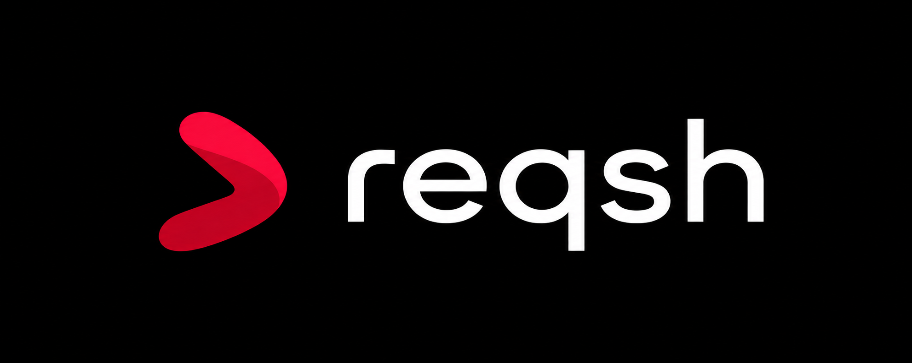

<p align="center">
  <a href="https://reqsh.dev">
    
  </a>
</p>

<p align="center">
  <strong>The interactive shell for HTTP requests.</strong>
</p>

<div align="center">

[](https://opensource.org/licenses/MIT)
[](http://makeapullrequest.com)

</div>

## About

This is the source code for **[reqsh.dev](https://reqsh.dev)** which serves the homepage, docs, changelog and roadmap for [reqsh](https://github.com/hars-21/reqsh).

The main reqsh project lives at **[github.com/hars-21/reqsh](https://github.com/hars-21/reqsh)**.

## Tech Stack

- [Next.js](https://nextjs.org) 16 (App Router)
- [Tailwind CSS](https://tailwindcss.com) v4
- [shadcn/ui](https://ui.shadcn.com)
- [TypeScript](https://www.typescriptlang.org)

## Getting Started

```sh
pnpm install
pnpm dev
```

The docs are synced from the main repo on build:

```sh
pnpm build  # runs sync-docs then next build
```

## Project Structure

```
src/
  app/
    page.tsx            # Homepage
    docs/               # Documentation pages
    changelog/          # Changelog
    roadmap/            # Roadmap
    install.sh/         # Install script proxy
    changelog.xml/      # RSS feed
  components/           # UI components
  lib/                  # Doc parsing and utilities
scripts/
  sync-docs.ts          # Pulls docs from GitHub
content/docs/           # Auto-generated (gitignored)
```

## License

[MIT](https://github.com/hars-21/reqsh/blob/main/LICENSE)
